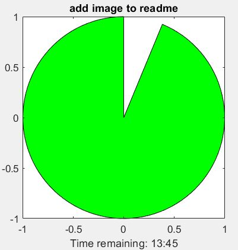
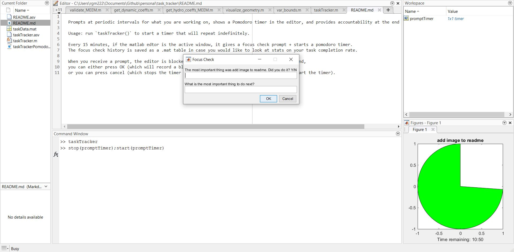

MATLAB productivity tool using native matlab UI. Prompts at periodic intervals 
for what you are working on, shows a Pomodoro timer in the editor, and provides 
accountability at the end of each timer. Helpful for ADHD and focus.

Usage: run `taskTracker()` to start a timer that will repeat indefinitely.
Consider adding this to your `startup.m` if you want it to start automatically when you open MATLAB.

Every 15 minutes, if the matlab edtor is the active window, it gives a focus check prompt + starts a pomodoro timer.
The focus check history is saved as a .mat table in case you would like to look at stats on your task completion rate.

When you receive a prompt, the editor is blocked until you respond. If you don't want to respond,
you can either press OK (which will record a blank task and start the pomodoro), 
or you can press cancel (which stops without starting the timer, and you will not receive prompts until you restart the timer).

If you finish your task early and want to force a new prompt+pomodoro, run `stop(promptTimer); start(promptTimer)`.
If your timer object got deleted from the workspace (ie you used `clear`), 
you can recover it using `timerfindall('Name','focus_prompt')`.

